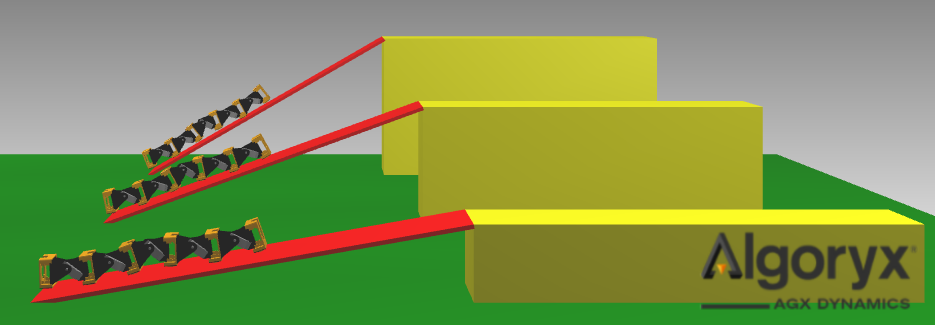

# agx_snake

Modular snake simulation in AgX Python.

======

### Installation

##### Python

1. Install Python 3.5.x from provided ZIP or from [here](https://www.python.org/downloads/release/python-354/).
2. Add Python to PATH if the installation did not do it for you.
3. Install a Python IDE. I recommend PyCharm Community. Find it in the provided ZIP or download from [here](https://www.jetbrains.com/pycharm/download/?gclid=CjwKCAjw-6bWBRBiEiwA_K1ZDUvz0gujReGyy1gph8Qs7UwFtYTpLkCVAXCfTqb92h42EHgo0XmkoRoCKIYQAvD_BwE&gclsrc=aw.ds.ds&dclid=COSr8pPBq9oCFRGSmwodsHUC9w#section=windows).

##### AgX

1. Install AgX from provided ZIP file or download link. Choose the x64 version for your OS.
2. Add *path/to/algoryx/AGX-2.x.x.x/bin/x64* to PATH.
3. Create a system variable named PYTHONPATH, and add *path/to/algoryx/AGX-2.x.x.x/bin/x64/agxpy*
